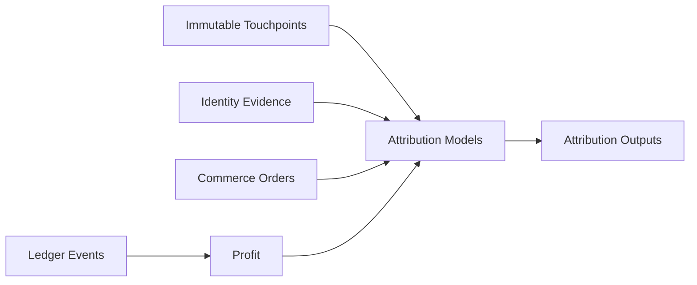

# TraceKit Attribution Engine

Status: foundational architecture specification.

## Core Question

Where did this customer come from?

TraceKit must answer:

- Which affiliate touched the customer first?
- Which campaign touched them first?
- Which source introduced them?
- What was the last touch before conversion?
- What paid, organic, affiliate, direct, email, or referral touches occurred
  between first touch and conversion?
- Which touch influenced the base order, upsell, rebill, or later purchase?
- Which touch or attribution model produced actual profit?

TraceKit is not a Hyros clone.

TraceKit combines attribution evidence with identity, commerce, payments, ledger
events, and profit.

## Immutable Activity Model

Every touchpoint must be stored as an immutable event.

TraceKit must never store only first touch and last touch. It must store every
observed touch and derive attribution models later.

## Canonical Attribution Event Fields

### Identity

| Field |
| --- |
| workspace_id |
| touchpoint_id |
| tkid |
| identity_id |
| visitor_id |
| device_id |
| session_id |
| journey_id |

### Event

| Field | Notes |
| --- | --- |
| occurred_at | Source event timestamp. |
| event_type | Canonical event type. |
| event_name | Source or user-facing event name. |
| event_source | Source system or service. |
| ingestion_method | API import, webhook, browser tracking, server event, or manual import. |

### Page / URL

| Field |
| --- |
| page_url |
| page_path |
| landing_page_url |
| referrer_url |
| referrer_domain |
| destination_url |
| outbound_url |

### Raw URL Evidence

| Field | Notes |
| --- | --- |
| raw_query_string | Original query string exactly as observed when possible. |
| raw_url_params JSON | All parsed URL parameters, including unknown parameters. |
| raw_fragment | URL fragment. |
| original_url | Original observed URL. |

### Normalized Marketing Parameters

| Field |
| --- |
| utm_source |
| utm_medium |
| utm_campaign |
| utm_term |
| utm_content |
| utm_id |

### Affiliate

| Field |
| --- |
| affiliate_id |
| offer_id |
| campaign_id |
| source_id |
| uid |
| sub1 through sub10 |
| affiliate_transaction_id |
| Everflow transaction ID |

### Advertising Click IDs

TraceKit must preserve known and future click IDs:

| Field |
| --- |
| gclid |
| gbraid |
| wbraid |
| dclid |
| fbclid |
| ttclid |
| msclkid |
| sccid |
| li_fat_id |
| any future or unknown click ID |

### Creative Context

| Field |
| --- |
| ad_id |
| adset_id |
| campaign_id |
| creative_id |
| placement |
| keyword |
| publisher |
| network |

### Technical Context

| Field |
| --- |
| user_agent |
| browser |
| device_type |
| operating_system |
| IP-derived country/region when legally permitted |
| first-party cookie identifiers |

## Critical URL Parameter Rule

TraceKit must record every URL parameter present at every touchpoint.

Known parameters should be normalized into first-class fields.

Unknown parameters must remain preserved in raw_url_params so future parsers and
attribution rules can use them.

Do not discard unknown parameters.

## Events To Capture

TraceKit should capture these event types when supported by a connector,
tracking library, webhook, or server-side integration:

| Event |
| --- |
| page view |
| landing |
| SPA route change |
| referral |
| ad click arrival |
| affiliate click arrival |
| CTA click |
| outbound click |
| form start |
| form submission |
| lead created |
| quiz start |
| quiz completion |
| checkout start |
| purchase |
| upsell |
| downsell |
| subscription |
| rebill |
| identity capture |
| identity merge |
| offline conversion |

## Attribution Outputs

Attribution services should produce these outputs from immutable touchpoint
facts:

| Output |
| --- |
| original first touch |
| last touch |
| first paid touch |
| last paid touch |
| first affiliate touch |
| last affiliate touch |
| first campaign touch |
| last campaign touch |
| touch immediately before lead |
| touch immediately before base order |
| touch immediately before upsell |
| touch immediately before rebill |
| complete touch sequence |
| session count before conversion |
| time from first touch to conversion |

## Attribution Models

Supported and future attribution models should be derived from facts, not stored
as replacements for facts:

| Model |
| --- |
| First Touch |
| Last Touch |
| First Paid Touch |
| Last Paid Touch |
| First Affiliate Touch |
| Last Affiliate Touch |
| Linear |
| Position Based |
| Time Decay |
| Custom Rule-Based |
| Profit-Weighted Attribution |

## Attribution Facts Versus Conclusions

| Observed Facts | Derived Conclusions |
| --- | --- |
| URL | Attributed source |
| Timestamp | Model credit |
| Referrer | First-touch designation |
| Query parameters | Last-touch designation |
| Click ID | Assisted conversion |
| Page/event | Attributed revenue |
| Raw source payload | Attributed profit |

Never overwrite facts when a model changes.

Attribution conclusions must be recalculable from preserved touchpoints,
identity evidence, commerce records, ledger events, and profit outputs.

## Attribution Integrity Rules

1. Original first touch is immutable.
2. Every observed touch is retained.
3. Direct traffic does not erase prior attribution.
4. Attribution windows are configurable.
5. Identity merges retain all pre-merge touch history.
6. Cross-device matching includes confidence and evidence.
7. Every attributed conversion can be traced to the touches used.
8. Attribution calculations must be reproducible.
9. URL parameters are stored at every touch.
10. Revenue attribution and profit attribution must be separately available.

## Tracking Implementation Roadmap

### Browser

Future-state browser tracking should support:

- First-party JS tracking library
- First-party cookies/local storage
- SPA route observation
- URL/referrer capture
- Form and CTA events
- Outbound URL enrichment
- Identity capture

### Server

Future-state server-side tracking should support:

- Server-side events
- Webhook events
- Order/payment lifecycle
- Offline conversions
- Redirect tracking
- Durable click/order mappings

### Privacy And Governance

Attribution collection and use must account for:

- Workspace configuration
- Retention controls
- Consent-aware collection
- PII separation
- Hashing where appropriate
- Least-privilege access
- Complete auditability

## Closing Principle

Attribution tells TraceKit where the customer came from and every meaningful
marketing touch that influenced the outcome.
