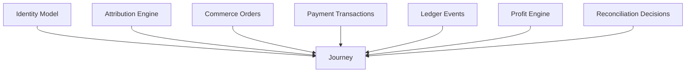

# TraceKit Journey Model

Status: foundational architecture specification.

## Core Principle

TraceKit's primary business object is the Journey, not the individual order.

A Journey is the complete acquisition, monetization, and financial lifecycle
associated with a customer or acquisition path.

Every Journey should reference both a Commerce Identity and an Attribution
Identity whenever those identities exist.

Identity tells TraceKit who the customer is.

Attribution tells TraceKit where the customer came from.

Journey tells TraceKit everything that happened.

The Ledger and Profit Engine tell TraceKit whether it made money.

## Dependency

Journey consumes:

- Identity Model
- Attribution Engine
- Commerce Orders
- Payment Transactions
- Ledger Events
- Profit Engine
- Reconciliation decisions



## Hierarchy

```text
Journey
|-- Anonymous visits
|-- Sessions
|-- Attribution touchpoints
|-- Leads
|-- Orders
|   |-- Base order
|   |-- Upsell
|   |-- Downsell
|   |-- Add-on
|   |-- Warranty
|   |-- Subscription
|   `-- Rebill
|-- Payment transactions
|   |-- Authorization
|   |-- Capture
|   |-- Refund
|   |-- Chargeback
|   |-- Processor fee
|   |-- Reversal
|   `-- Adjustment
|-- Ledger events
`-- Profit
```

## Reporting Levels

| Level | Definition |
| --- | --- |
| Transaction | One financial event. |
| Order | One commercial order, which may have multiple payment and ledger events. |
| Journey | The complete acquisition and monetization lifecycle. |

## Journey Identifiers

| Identifier | Purpose |
| --- | --- |
| journey_id | Canonical Journey identifier. |
| identity_id | Customer or person identity for the Journey. |
| order_group_id | Grouping for related base orders, upsells, subscriptions, and adjustments. |
| primary_tkid | Primary TraceKit tracking identifier. |
| primary affiliate/click IDs | Main affiliate or click identifiers associated with acquisition. |
| base_order_id | Initial commercial order. |
| first_touchpoint_id | First observed attribution touch. |
| last_touchpoint_id | Most recent meaningful attribution touch. |
| first_order_at | Timestamp of first order. |
| last_activity_at | Timestamp of most recent Journey activity. |

## Journey Status Examples

Journey status should reflect lifecycle state without hiding underlying events:

| Status |
| --- |
| anonymous |
| identified |
| lead |
| converted |
| active_customer |
| subscribed |
| refunded |
| charged_back |
| inactive |
| closed |

## Parent-Child Commerce Model

Do not collapse separate charges.

Base purchases, upsells, downsells, warranties, subscriptions, and rebills remain
separate orders and transactions.

Connect them through:

- journey_id
- order_group_id
- parent_order_id
- parent_transaction_id
- upsell_chain_id
- subscription_id
- sequence number
- transaction role

Example:

```text
Journey J-100
- Base order O-1
- Upsell O-2, parent O-1
- Warranty O-3, parent O-1
- Subscription O-4
- Rebill O-5, parent/subscription O-4
- Refund against O-2
- Chargeback against O-1
```

## Journey Profit

Journey Profit must include all signed ledger events across all associated
orders and payment transactions.

The Journey profit view should show:

| Profit Component |
| --- |
| gross revenue |
| refunds |
| chargebacks |
| processor fees |
| chargeback fees |
| shipping |
| tax |
| COGS |
| affiliate payouts |
| ad spend |
| adjustments |
| net profit |
| margin |

## Journey Attribution

Journey must retain:

- First touch
- Last touch
- Every touch
- First affiliate
- Last affiliate
- First paid campaign
- Last paid campaign
- Assists
- Configurable model results

Attribution conclusions should be linked to the touchpoint facts and model
configuration that produced them.

## Reconciliation Principles

1. Exact deterministic identifiers first.
2. Parent-child references before customer heuristics.
3. Never collapse separate upsell captures into a duplicate base sale.
4. Payment events attach to the exact child order when known.
5. Unmatched activity remains preserved.
6. Manual reconciliation decisions are audited and reusable.

## Journey Timeline

A Journey timeline should combine:

- Anonymous visits
- Ad and affiliate clicks
- Landing pages
- Form/lead events
- Base purchase
- Upsells
- Subscriptions
- Payment captures
- Fees
- Refunds
- Chargebacks
- Later purchases
- Profit changes

Every timeline event must link back to its source record or raw payload.

## Future-State Journey UI

The Journey page should eventually show:

- Customer identity
- Identity health
- Complete attribution path
- Order tree
- Parent/child transactions
- Payment lifecycle
- Ledger timeline
- Profit summary
- Reconciliation status
- Raw evidence drill-down

## Closing Principle

Identity tells TraceKit who the customer is.

Attribution tells TraceKit where the customer came from.

Journey tells TraceKit everything that happened.

The Ledger and Profit Engine tell TraceKit whether it made money.
