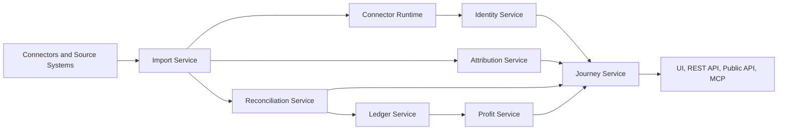

# TraceKit Architecture

Status: foundational architecture specification.

These documents are the canonical source of truth for future connectors,
services, REST APIs, Public APIs, MCP tools, admin UI, and customer UI.

Read them in this order:

1. [Identity Model](./IDENTITY_MODEL.md)
2. [Identity Service v1](../identity/IDENTITY_SERVICE_V1.md)
3. [Identity Backfill Runtime v1](../identity/IDENTITY_BACKFILL_RUNTIME_V1.md)
4. [Attribution Engine](./ATTRIBUTION_ENGINE.md)
5. [Journey Model](./JOURNEY_MODEL.md)

The dependency is intentional:

1. Identity determines who and what records belong together.
2. Attribution determines where a person came from and every marketing touch.
3. Journey combines identity, attribution, commerce, payment, ledger, and profit
   into one lifecycle.

## Core Platform Principle

Every number and conclusion in TraceKit must be explainable and traceable back
to source records and immutable events.

No dashboard metric, reconciliation decision, attribution result, profit value,
or Journey conclusion should exist without evidence that can be inspected.

## Service Architecture

TraceKit business behavior should live in shared services. The UI, REST API,
future Public API, and MCP server must call the same underlying business
services instead of reimplementing connector, identity, attribution,
reconciliation, ledger, or profit logic.

| Service | Responsibility |
| --- | --- |
| Import Service | Pulls or receives source records from connectors, stores raw evidence, and hands records to downstream services. |
| Connector Runtime | Runs bounded connector imports and maintenance jobs with durable progress before downstream enrichment, including identity backfills for existing source records. |
| Identity Service | Resolves deterministic identity relationships while preserving source-specific identifiers and audit evidence. |
| Attribution Service | Stores immutable touchpoints and derives attribution conclusions from observed evidence. |
| Reconciliation Service | Links commerce, payment, affiliate, subscription, and customer records using auditable evidence. |
| Journey Service | Builds the lifecycle view across identity, attribution, orders, payments, ledger events, and profit. |
| Ledger Service | Writes append-only financial events and prevents duplicate immutable events. |
| Profit Service | Builds order, daily, and Journey profit rollups from ledger and related cost inputs. |

## Business-Service Ownership

Application surfaces are delivery layers:

- The customer UI displays service results and sends user actions to services.
- The admin UI configures and audits service behavior.
- REST APIs expose service behavior to first-party clients.
- The future Public API exposes stable service contracts to customers.
- MCP wraps stable TraceKit business services and does not own identity,
  attribution, reconciliation, ledger, or profit logic.

MCP tools may initiate actions, retrieve explanations, or present evidence, but
the underlying decisions must remain in TraceKit services.

## Roadmap Order

Preserve this product and architecture roadmap order:

1. Shared Import Framework
2. Connector Runtime
3. Identity Service
4. Attribution Engine
5. Ledger and Profit Enrichment
6. Journey Model
7. Reconciliation Center
8. Public API
9. MCP
10. Premium UI

This order keeps ingestion and evidence capture ahead of advanced user-facing
experiences. TraceKit should not expose premium conclusions before the evidence
model, reconciliation model, and audit trail can support them.

## Canonical Documentation Boundary

These documents define product and architecture requirements. They do not claim
that every future-state object, service, field, or UI already exists in the
current codebase.

When implementation differs from these specifications, future work should either
move implementation toward the specification or update these documents through an
intentional architecture review.
